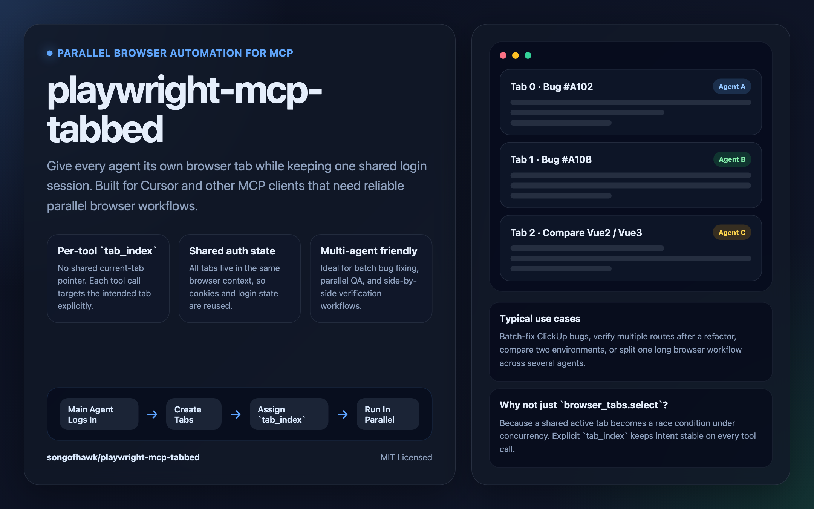

# playwright-mcp-tabbed

[English README](./README.md)



> 面向并行 Agent 工作流的 Tab 感知 Playwright MCP Server。

`playwright-mcp-tabbed` 为 Playwright MCP 工具增加了显式的 `tab_index` 能力，让多个 Agent 可以在不同标签页中并行操作，同时共享同一个浏览器上下文和登录态。

## 要解决的问题

官方 `@playwright/mcp` 更偏向“共享当前页面”的模型，这在单 Agent 场景下没问题，但到了并发工作流里会出现典型竞态：

- Agent A 先切到 tab 1
- Agent B 又切到 tab 2
- Agent A 的下一步操作，可能实际落到了 tab 2 上

`playwright-mcp-tabbed` 的目标就是去掉这种“共享当前 tab”的假设，让每一次工具调用都能显式指向目标标签页。

## 典型使用场景

这个项目最适合放在“浏览器自动化只是更大 Agent 工作流的一部分”这种场景里。

### 1. 批量修复缺陷

主 Agent 登录一次后，统一创建多个 tab，并把不同的 `tab_index` 分配给不同的缺陷修复子 Agent。每个子 Agent 都能在自己的标签页里独立复现、修复、验证问题，同时复用同一份登录态。

### 2. 多路由并行回归验证

一次重构后，让不同 Agent 同时检查 `/orders`、`/wallet`、`/settings`、`/users` 等页面，不必反复登录，也不会互相抢当前页面。

### 3. 多环境或双版本对比

一个 tab 打开旧版页面，一个 tab 打开新版页面，另一个 tab 打开 staging 环境。多个 Agent 可以并行做行为对比、样式对比或迁移验证。

### 4. 拆分超长浏览器流程

某些业务链路很长，不适合让一个 Agent 串行完成。可以把不同子流程拆到不同 tab，再分配给不同 Agent 并行执行。

## 工作原理

- 一个浏览器实例
- 一个共享的 browser context
- 多个标签页
- 每次浏览器工具调用都可以显式指定 `tab_index`

这样带来的直接收益是：

- 所有 tab 共享 cookie 和登录态
- 每次调用都能稳定路由到正确 tab
- 更适合多 Agent 编排

## 核心特性

- 为绝大多数浏览器工具增加 `tab_index` 与稳定的 `tab_id`
- 通过共享 browser context 复用登录状态（**同一 origin 下**各 tab 共享 cookie）
- `browser_context_info` 汇总当前 tab、origin，并说明 `localhost` 与 `127.0.0.1` 的 cookie 不互通
- 支持环境变量 `PLAYWRIGHT_MCP_BASE_URL` 与 `browser_navigate.base_url`，便于用 `/path` 相对路径导航
- `browser_snapshot` 支持 `root_selector`、`max_chars`，控制 MCP 返回体积
- `browser_click` 支持 `force`、`trial`、`timeout`（与 Playwright 语义一致）
- `browser_network_requests` 支持 `limit`、`url_contains`
- 工具命名尽量贴近官方 Playwright MCP
- 适合 Cursor 和其他 MCP 客户端
- 以“并发 Agent 下的确定性行为”为设计目标

## 已支持的工具

- `browser_tabs`
  支持 `action: "list" | "new" | "close"`；`new` 可选 `label`；列表包含每个 tab 的 `tab_id`
- `browser_context_info`
  返回各 tab、origin 及「按 origin 隔离存储」的说明
- `browser_navigate`
- `browser_snapshot`
- `browser_take_screenshot`
- `browser_run_code`
- `browser_click`
- `browser_type`
- `browser_fill_form`
- `browser_file_upload`
- `browser_hover`
- `browser_select_option`
- `browser_press_key`
- `browser_wait_for`
- `browser_evaluate`
- `browser_navigate_back`
- `browser_network_requests`
- `browser_console_messages`
- `browser_resize`
- `browser_drag`
- `browser_handle_dialog`
- `browser_close`
- `browser_install`

面向页面的工具支持 **`tab_index` 或 `tab_id` 二选一**（不要同时传）。并行子 Agent 建议优先用 `tab_id`，避免创建顺序变化导致指错 tab。

```json
{ "tab_index": 1 }
```

```json
{ "tab_id": "550e8400-e29b-41d4-a716-446655440000" }
```

无需 tab 参数的工具：`browser_tabs`、`browser_close`、`browser_install`、`browser_context_info`。

### 环境变量

- `PLAYWRIGHT_MCP_BASE_URL` — 可选，作为 `browser_navigate` 中相对路径的默认站点根（如 `http://127.0.0.1:3000`）。
- `PLAYWRIGHT_MCP_RECORD_VIDEO_DIR` — 可选，指定一个可写目录来启用 Playwright 录屏。设置后，共享 browser context 中新建的每个 tab/page 都会录制视频；视频文件会在页面关闭或 browser context 关闭后完成落盘。

## 与官方 `@playwright/mcp` 的差异

- 故意不实现 `browser_tabs.select`
- 用显式 `tab_id` 替代“切当前 tab”的模式
- 设计目标是并发 Agent 场景，而不是共享当前活动页的交互模型

## 快速开始

### 基于 npm 分发安装

```bash
npm install playwright-mcp-tabbed
```

### 本地安装

```bash
git clone https://github.com/songofhawk/playwright-mcp-tabbed
cd playwright-mcp-tabbed && npm install
```

### 在 Cursor 中配置
把下面内容加入 `~/.cursor/mcp.json`：

```json
{
  "mcpServers": {
    "playwright-tabbed": {
      "command": "node",
      "args": ["/absolute/path/to/playwright-mcp-tabbed/dist/index.js"],
      "env": {
        "PLAYWRIGHT_MCP_RECORD_VIDEO_DIR": "/absolute/path/to/recordings"
      }
    }
  }
}
```

你可以保留官方 `playwright` MCP，只在并发浏览器任务里切换到 `playwright-tabbed`；也可以直接使用本 mcp 代替官方版本。

如果不需要录屏，可以不配置 `env`，或者不要设置 `PLAYWRIGHT_MCP_RECORD_VIDEO_DIR`。

## Agent Skill：多标签编排
本仓库附带一份可选的 **Agent Skill**（适用于 Cursor、Claude Code 等宿主），设计了一套使用流程：**主 Agent**如何建标签页、为**并行子 Agent**分配稳定 `tab_id`、最后汇总。

- **在仓库中的路径：** [`skills/playwright-tabbed-orchestration/`](./skills/playwright-tabbed-orchestration/)，内含 `SKILL.md` 与辅助脚本 `scripts/resolve-base-url.js`。
- **前提：** 在客户端中已配置 `playwright-tabbed` MCP（见上文 [在 Cursor 中配置](#在-cursor-中配置)）。
- **说明：** **npm 包**包含服务端构建（`dist/`）与 `skills/`。安装依赖后可从 `node_modules/playwright-mcp-tabbed/skills/playwright-tabbed-orchestration` 复制；也可直接 clone 仓库或使用下文 GitHub 子路径，路径更直观。

### Skill 内容概要
解析 `PLAYWRIGHT_BASE_URL`、打开 `N` 个 tab、拆分 URL/场景列表、并行启动 `N` 个子 Agent（各绑定一个 `tab_id`）、汇总结果。完整步骤、门禁与子 Agent 提示词模版见 [`SKILL.md`](./skills/playwright-tabbed-orchestration/SKILL.md)。

### 安装 Skill
**Cursor** — 将整个目录复制到当前 Cursor 版本识别的 skills 目录，例如：

- 项目内：`<你的项目>/.cursor/skills/playwright-tabbed-orchestration/`
- 或按 Cursor 文档使用用户级全局 skills 路径。

**Claude Code** — 复制到：

- `<仓库>/.claude/skills/playwright-tabbed-orchestration/`（或 Anthropic 文档中的全局 skills 位置）。

**OpenAI Codex** — 使用 Codex **skill-installer**，指定本仓库与子路径（若默认分支不是 `main`，请加 `--ref`）：

```bash
python scripts/install-skill-from-github.py \
  --repo songofhawk/playwright-mcp-tabbed \
  --path skills/playwright-tabbed-orchestration
```

亦可使用树形 URL：
`https://github.com/songofhawk/playwright-mcp-tabbed/tree/main/skills/playwright-tabbed-orchestration`

复制或安装完成后，重启 Agent 或者新开会话。

### 辅助脚本 `resolve-base-url.js`
根据 `PLAYWRIGHT_BASE_URL`（环境变量，和/或 Git 仓库根目录下的 `.env.local` / `.env` / `playwright.env.local`）解析站点根 URL。若依赖业务项目里的 env 文件，请让**终端当前工作目录落在该业务仓库**，或直接导出 `PLAYWRIGHT_BASE_URL`。


## 什么时候适合用它

适合使用 `playwright-mcp-tabbed` 的情况：

- 有多个子 Agent 并行执行浏览器任务
- 这些任务需要共享登录态
- 你希望浏览器操作稳定落到指定 tab，而不是依赖共享当前 tab

继续使用官方 `@playwright/mcp` 的情况：
- 只有一个 Agent
- 整个流程严格串行
- 不需要多个并发任务共享标签页和会话

## 当前限制
这个项目明确偏向“显式 tab 路由”，而不是“当前活动 tab”语义。如果你的调用链强依赖 `browser_tabs.select`，那它并不是完全等价替代。

## 开源协议
MIT
